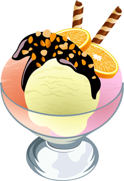
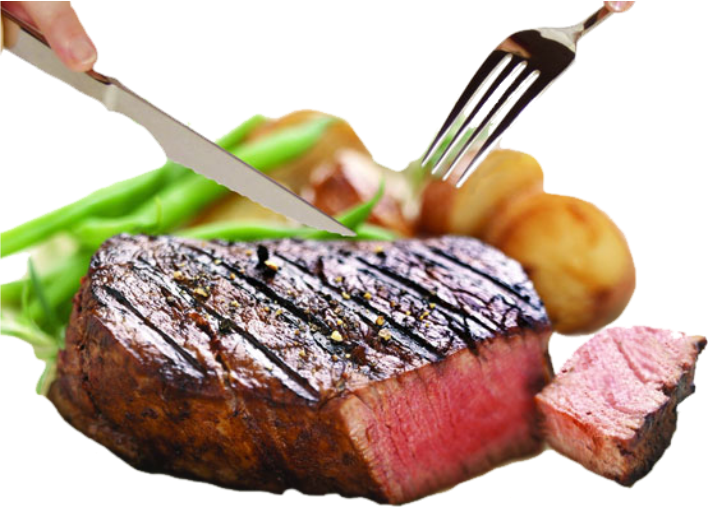
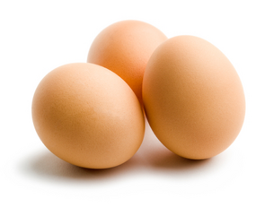
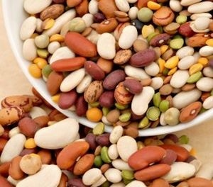
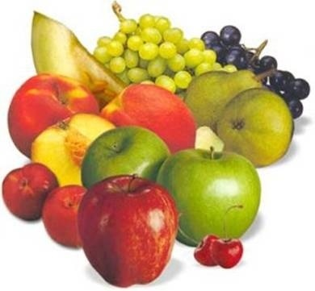
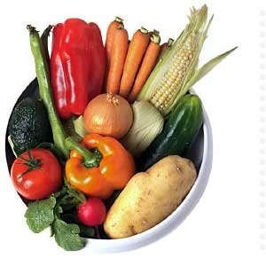

## Realizar una página web que tenga el siguiente aspecto, es una tabla que contiene imágenes y fusiona columnas:

 

```html 
 <!DOCTYPE html PUBLIC "-//W3C//DTD XHTML 1.0 Strict//EN" "http://www.w3.org/TR/xhtml1/DTD/xhtml1-strict.dtd">
 <!-- plantilla para paginas web-->
<html xmlns="http://www.w3.org/1999/xhtml" xml:lang="es" lang="es">
  <head>
    <meta http-equiv="Content-Type" content="text/html; charset=utf-8" />
    <title>Práctica 18</title>
  </head>
  <body>
		<table border="1">
			<caption>TIPOS</caption>
			<tr>
				<th colspan="6">Los Alimentos</th>
			</tr>
			<tr colspan="6">
				<th>Energéticos</th>
				<th colspan="2">Plásticos</th>
				<th colspan="2">Reguladores</th>
				<th></th>
			</tr>
			<tr colspan="6">
				<th>Azucares</th>
				<th>Grasas</th>
				<th colspan="2">Proteinas</th>
				<th colspan="2">Vitaminas</th>
			</tr>
			<tr>
				<th>Dulces</th>
				<th>Carne</th>
				<th>Huevos</th>
				<th>Legumbres</th>
				<th>Frutas</th>
				<th>Verduras</th>
			</tr>
			<tr>
				<th><a href="https://www.tipicodeburgos.com/categoria-producto/productos-tipicos-de-burgos/dulces-chocolates-burgos/"></a></th>
				<th><a href="https://es.wikipedia.org/wiki/Carne"></a></th>
				<th><a href="https://es.wikipedia.org/wiki/Huevo_(alimento)"></a></th>
				<th><a href="https://es.wikipedia.org/wiki/Legumbre"></a></th>
				<th><a href="https://es.wikipedia.org/wiki/Fruta"></a></th>
				<th><a href="https://es.wikipedia.org/wiki/Verdura"></a></th>
			</tr>
		</table>
  </body>
</html>
```
