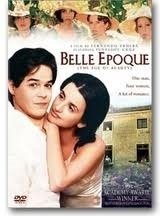

## Realiza una página web con el siguiente aspecto 


 ```html
 <!DOCTYPE html PUBLIC "-//W3C//DTD XHTML 1.0 Strict//EN" "http://www.w3.org/TR/xhtml1/DTD/xhtml1-strict.dtd">
 <!-- plantilla para paginas web-->
<html xmlns="http://www.w3.org/1999/xhtml" xml:lang="es" lang="es">
  <head>
    <meta http-equiv="Content-Type" content="text/html; charset=utf-8" />
    <title>Lenguaje de marcas</title>
  </head>
  <body>
		<table border="1" id="Inicio">
		<caption>PELICULAS RECOMENDADAS</caption>
			<tr>
				<th colspan="3">CARTELERA DE CINE</th>
			</tr>
			<tr>
				<td></td>
				<td>ANIMACION</td>
				<td>ACTORES</td>
			</tr>
			<tr>
				<th rowspan="2">INFANTIL</th>
				<td>
					<ol>
						<a href="#parrafo1"><li>Bambi</li></a>
						<a href="#parrafo2"><li>La Sirenita</li></a>
						<a href="#parrafo3"><li>Blancanieves</li></a>
					</ol>
				</td>
				<td>
					<ul>
						<li>Mari Poppins</li>
						<li>La Bruja Novata</li>
					</ul>
				</td>
			</tr>
			<tr>
				<td>
					
					<map name="elpanaflounder">
						<a href="paginas/flounder.html"><area shape="circle" coords="145,40,30"/></a>
						<a href="paginas/ariel.html"><area shape="rect" coords="65,69,233,169"/></a>
					</map>
				</td>
				<td>
					<ul>
						<li>Harry Potter</li>
						<li>La Bruja Dorada</li>
					</ul>
				</td>
			</tr>
			<tr>
				<th rowspan="2">ADULTOS</th>
					<td rowspan="2">
						<ul>
							<li>El viaje de Chiniro</li>
							<li>Akira</li>
						</ul>
					</td>
					<td>
						<a href="http://es.wikipedia.org/wiki/Belle_%C3%89poque_(pel%C3%ADcula"></a>
					</td>
			</tr>
			<tr>		
				<td>	
					<ul>
						<li>Volver</li>
						<li>Belle Epoque</li>
					</ul>
				</td>
			</tr>
			
		</table>
		<h1>Vida de Walt Disney</h1>
		<p id="parrafo1">Walt Disney nació el 5 de diciembre de <b>1901</b>  y tuvo la infancia típica del hijo de un granjero.
 Su padre, Elias Disney <b>(1859-1941)</b>, de antepasados irlandeses, había llegado a Estados Unidos desde Canadá y se había instalado en Chicago poco
 después de contraer matrimonio con la maestra de escuela Flora Call <b>(1868-1938)</b>, en <b>1888</b>.
 Walt nació en <b>1901</b>, siendo el cuarto de los cinco hijos del matrimonio. En <b>1906</b> -según algunos, huyendo de la creciente criminalidad existente en Chicago-,
 la familia se trasladó a una granja en las cercanías de Marceline, Misuri. Más adelante, Disney diría que esos fueron los años más felices de su vida. 
 Como tanto él como su hermana menor, Ruth, eran demasiado pequeños para ayudar en las labores de la granja, pasaban la mayor parte del tiempo jugando.
 De esta época datan los primeros escarceos de Disney con el dibujo y su gran afición por los trenes. Este período idílico concluyó pocos años después.
 En 1909, Elias Disney cayó repentinamente enfermo de fiebres tifoideas, y, a pesar de contar con la ayuda de sus hijos mayores, se vio imposibilitado 
 de continuar trabajando en la granja. La vendió a regañadientes, y la familia vivió en una casa alquilada hasta <b>1910</b>, año en que se mudaron a Kansas City.
 Para el joven Disney fue muy duro tener que abandonar su paraíso rural.<br/> </p>
 
<p id="parrafo2">En Kansas City, Elias empezó a trabajar repartiendo periódicos para el Kansas City Star. 
 A Walt y a su hermano Roy les correspondió ayudar a su padre en el reparto, un trabajo duro que requería levantarse todos los días a las doce de la noche. 
De acuerdo con los archivos de la escuela pública del distrito de Kansas City, Disney empezó a asistir a la Benton Grammar School en <b>1910</b>, y se graduó el 
8 de junio de <b>1911</b>. No fue un buen estudiante: a causa de su trabajo repartiendo periódicos, le costaba concentrarse y con frecuencia se quedaba dormido. 
Era propenso a soñar despierto y a pasar el tiempo haciendo garabatos.<br/>

Elias, dejó su trabajo como repartidor de periódicos y se convirtió en uno de los propietarios de una empresa dedicada a elaborar bebidas carbonatadas,
 la O'Zell Company, radicada en Chicago. La familia se trasladó a esta ciudad, y Disney continuó sus estudios en la McKinley High School de Chicago.
 Al mismo tiempo, trabajaba para su padre y asistía por las tardes a clases en el Instituto de Arte de Chicago.
A los 15 años, Walt consiguió un trabajo de verano vendiendo periódicos y chucherías a los pasajeros del ferrocarril de Santa Fe.
 Le interesaba mucho más el tren que su trabajo, en el que no tuvo demasiado éxito, ya que con frecuencia le robaban la mercancía.
 En sus años escolares, Disney fue el historietista del periódico del instituto, The Village Voice. Sus cómics eran de tema patriótico y político, centrados en e
 tema de la Primera Guerra Mundial.<br/></p>
 
<p id="parrafo3">En <b>1918</b>, queriendo seguir los pasos de su hermano Roy, que se había enrolado en la marina, abandonó el instituto para
 alistarse en el ejército. No fue aceptado por ser demasiado joven. Enterado de que el cuerpo de ambulancias de la Cruz Roja admitía a chicos de diecisiete años,
 Walt falsificó su certificado de nacimiento para hacer ver que había nacido en <b>1900</b> en lugar de en <b>1901</b>, y había cumplido ya los diecisiete.
Fue admitido, pero nunca llegó a entrar en combate. Cuando terminó su entrenamiento y fue trasladado a Europa, Alemania había firmado el armisticio,
 y la guerra había terminado. Pasó el resto de su tiempo en la Cruz Roja como conductor de ambulancias en Francia, trasladando a oficiales. 
 Se entretuvo llenando de dibujos la ambulancia que conducía. Fue también en esta época cuando empezó a fumar, un hábito que le acompañaría durante toda su vida.
 En <b>1919</b> solicitó ser relevado de sus obligaciones militares y fue enviado de regreso a Estados Unidos.</p>
 <a href="#Inicio">Volver al inicio de la página</a>
  </body>
</html>
```
